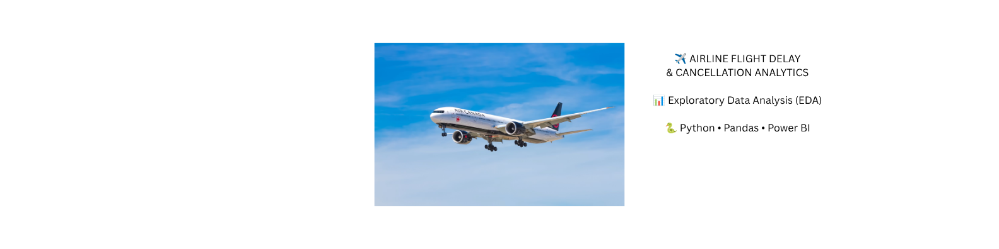

 

  

  

---

# ✈️ Airline Flight Delay & Cancellation Analytics

> ### 📊 Exploratory Data Analysis (EDA) using Python & Power BI

Analyze airline delays, cancellations, airport performance, and operational efficiency through **Python**, **EDA**, and an interactive **Power BI Dashboard**.

---

---

## 🚀 Project Status

🟢 Completed

✅ Python Data Cleaning

✅ Exploratory Data Analysis

✅ Power BI Dashboard

✅ Business Insights

✅ GitHub Documentation

---
